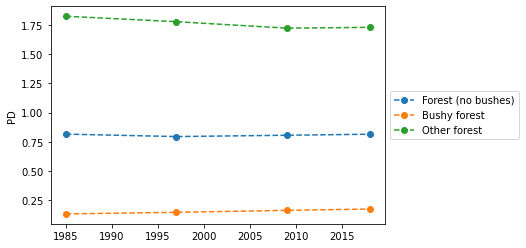

[](https://github.com/martibosch/pylandstats-swiss-forests/blob/master/LICENSE)
[](https://mybinder.org/v2/gh/martibosch/pylandstats-swiss-forests/master?filepath=notebooks)

# PyLandStats Swiss forests

Analysis with PyLandStats of forest evolution in the Swiss cantons of Bern, Fribourg, Neuchatel and Vaud.



This repository is part of the [YoMos 2020](https://www.yomos.org) workshop.

## Instructions to execute

### Option 1: via MyBinder

Click the badge below, which will use [MyBinder](https://mybinder.org/) to launch a server with a Jupyter executable environment:

[](https://mybinder.org/v2/gh/martibosch/pylandstats-swiss-forests/master?filepath=notebooks)

### Option 2: locally

1. If you do not have `conda` in your computer, [download and install it](https://docs.conda.io/projects/conda/en/latest/user-guide/install/download.html).

2. Clone the repository and change directory to the repository's root:

```bash
git clone https://github.com/martibosch/pylandstats-swiss-forests
cd pylandstats-swiss-forests
```

3. Create the environment and activate it:

```bash
conda env create -f environment.yml
# the above command creates a conda environment named `pylandstats-swiss-forests`
conda activate pylandstats-swiss-forests
```

4. Register the IPython kernel of the `pylandstats-swiss-forests` environment:

```bash
python -m ipykernel install --user --name pylandstats-swiss-forests --display-name \
    "Python (pylandstats-swiss-forests)"
```

5. You can test that the installation worked by running the following command:

```bash
python -c 'import pylandstats as pls ;  pls.Landscape("data/raw/AS18_17.tif") ; print("OK")'
```

6. Run a local jupyter notebook server and you can now exectue [the notebooks of this repository](https://github.com/martibosch/pylandstats-swiss-forests/blob/notebooks):

```bash
jupyter-notebook --notebook-dir=notebooks
```


## Acknowledgements

* The land use/land cover data has been extracted from the [Swiss Land Statistics datasets from the Swiss Federal Statistical Office (SFSO)](https://www.bfs.admin.ch/bfs/fr/home/services/geostat/geodonnees-statistique-federale/sol-utilisation-couverture/statistique-suisse-superficie.html) (link in French) with the [swisslandstats-geopy](https://github.com/martibosch/swisslandstats-geopy) library.
* The digital elevation model has been extracted from the [free version of the digital height model of Switzerland by the Swiss Federal Office of Topography (swisstopo)](https://shop.swisstopo.admin.ch/en/products/height_models/dhm25200).
* Project based on the [cookiecutter data science project template](https://drivendata.github.io/cookiecutter-data-science). #cookiecutterdatascience
